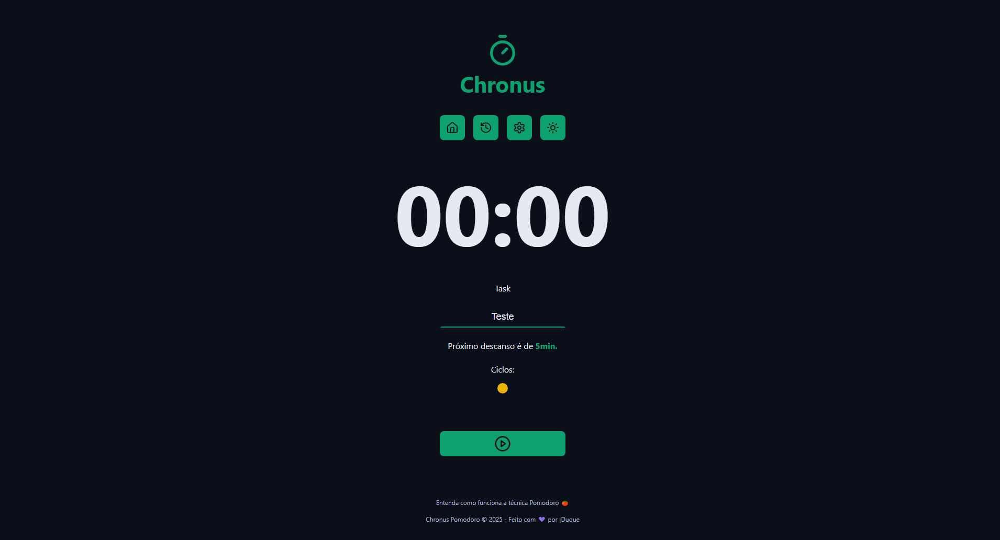

<div align="center" id="top">
    
  &#xa0;
    
  &#xa0;
    
  &#xa0;

  <a href="https://chronuspomodoro.verecel.app">Live Demo</a>
</div>

<h1 align="center">Chronus Pomodoro App</h1>

<p align="center">
  

  

  

  

  <!--  -->

  <!--  -->

  <!--  -->
</p>

<!-- Status -->

<!-- <h4 align="center">
	🚧  Chronus Pomodoro 🚀 Under construction...  🚧
</h4>

<hr> -->

<p align="center">
  <a href="#dart-about">About</a> &#xa0; | &#xa0;
  <a href="#sparkles-features">Features</a> &#xa0; | &#xa0;
  <a href="#rocket-technologies">Technologies</a> &#xa0; | &#xa0;
  <a href="#white_check_mark-requirements">Requirements</a> &#xa0; | &#xa0;
  <a href="#checkered_flag-starting">Starting</a> &#xa0; | &#xa0;
  <a href="#memo-license">License</a> &#xa0; | &#xa0;
  <a href="https://github.com/meDuque" target="_blank">Author</a>
</p>

<br>

## :dart: About ##

A pomodoro app that helps you stay focused and productive. It's a simple and intuitive tool that allows you to work in focused 25-minute increments, with scheduled breaks in between.

## :sparkles: Features ##

:heavy_check_mark: Dark and Light theme change;\
:heavy_check_mark: History data;\
:heavy_check_mark: Custom timer settings;\
<!-- :heavy_check_mark: Feature 3; -->

## :rocket: Technologies ##

The following tools were used in this project:

- [Vite](https://vite.dev/)
- [React](https://pt-br.reactjs.org/)
- [TypeScript](https://www.typescriptlang.org/)
<!-- - [Node.js](https://nodejs.org/en/) -->
<!-- - [React Native](https://reactnative.dev/) -->

## :white_check_mark: Requirements ##

Before starting :checkered_flag:, you need to have [Git](https://git-scm.com) and [Node](https://nodejs.org/en/) installed.

## :checkered_flag: Starting ##

```bash
# Clone this project
$ git clone https://github.com/meDuque/chronus-pomodoro

# Access
$ cd chronus-pomodoro

# Install dependencies
$ yarn

# Run the project
$ yarn start

# The server will initialize in the <http://localhost:3000>
```

## :memo: License ##

This project is under license from MIT. For more details, see the [LICENSE](LICENSE.md) file.


Made with :heart: by <a href="https://github.com/meDuque" target="_blank">¡Duque</a>

&#xa0;

<a href="#top">Back to top</a>
